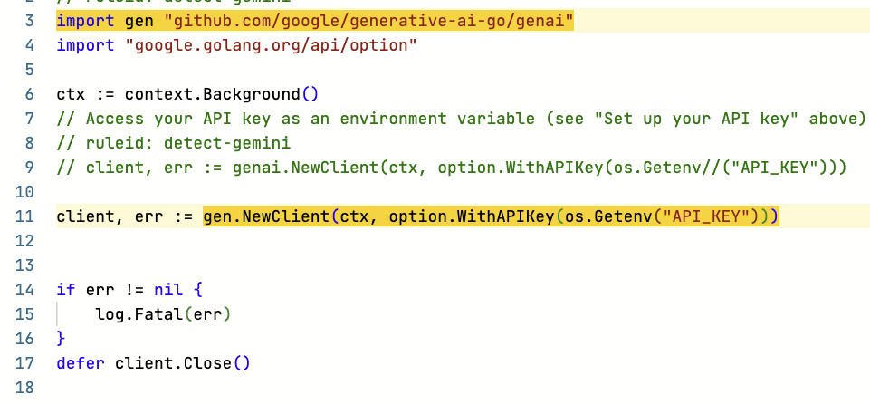
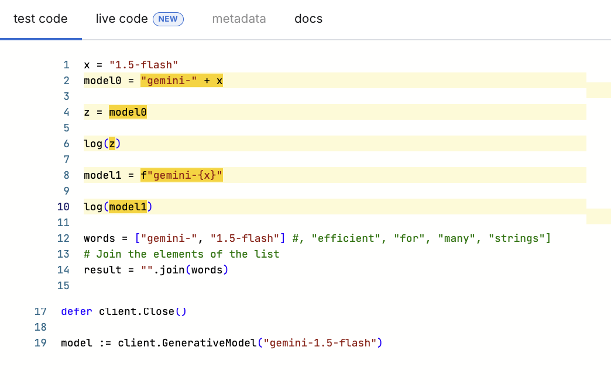
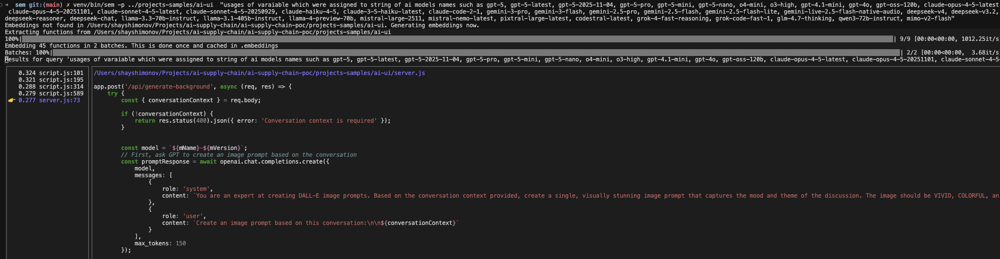

# AI API Usage Detection: Open Source Tools Evaluation
Ticket: [AST-127784 AI Supply Chain | AI Libraries Discovery | Research | Alternative Libraries for AI usage detection](https://checkmarx.atlassian.net/browse/AST-127784)

## TL;DR

**Tree-sitter (Python bindings) produced the best results in the fastest time**, successfully detecting AI model usage including string concatenation, variable tracking, and API call identification. It meets most of the detection challenges outlined in this evaluation.

Other tools evaluated:
- **Semgrep**: Good results for import aliases and variable tracking, but competitor library with licensing concerns
- **xbom**: Limited results, missed JavaScript AI usage entirely
- **semantic-code-search (sem)**: Poor results and many false negatives despite high certainty scores

---

# Background
This document summarizes the evaluation results of open-source detection tools for identifying AI API usage, model references, and LLM integrations in source code. 

The evaluation consists of comparing multiple tools on the same codebase to understand their strengths, weaknesses, and complementary capabilities.

**Sample Projects Scanned:**
- **ai-ui** (JavaScript)
- **OpenHands** (Python)

The purpose of this evaluation is to explore and experiment with tools that can enhance our AI detection capabilities in several ways:

- **Complementary Data**: Identify tools that can provide additional insights beyond our current detection methods, such as semantic understanding of code context, variable-based model construction, and dynamic API usage patterns
- **Improved Accuracy**: Evaluate approaches that reduce false positives and false negatives, including machine learning-based semantic search that understands code intent rather than just pattern matching
- **Alternative Approaches**: Discover alternative detection methodologies, such as combining static analysis (pattern-based rules) with semantic search (natural language queries), to create a more comprehensive view of AI usage


## Detection Challenges

Detecting AI API usage in source code presents several unique challenges that traditional static analysis tools may miss:

### 1. String Concatenation

Model names are often constructed dynamically by concatenating strings, making them difficult to detect with simple pattern matching:

```javascript
// Variable concatenation
const modelVersion = "1.5-flash";
const modelName = "gemini-" + modelVersion;  // Results in "gemini-1.5-flash"

// Template literals
const model = `gemini-${modelVersion}`;  // Also results in "gemini-1.5-flash"
```

**Challenge**: Static analysis tools looking for literal string "gemini-1.5-flash" will miss these dynamically constructed references.

### 2. Variable Assignment Tracking

Model names may be assigned to variables and passed through multiple assignments before being used in API calls, requiring data flow analysis:

```javascript
// Initial assignment
const y = "gemini-1.5-flash";

// Variable reassignment
const z = y;

// Usage in API call or logging
log(z);  // The actual model name is several steps removed from usage
```

**Challenge**: Detecting where AI models are actually used requires tracking variable assignments through the code flow. Simple pattern matching cannot follow these chains of assignments to understand that `z` ultimately contains an AI model name.

### 3. Import Aliases

When searching for specific imports, aliased import statements can evade detection:

```go
// Standard import with alias
// import "github.com/google/generative-ai-go/genai"

// alias
import gen "github.com/google/generative-ai-go/genai"
import "google.golang.org/api/option"

ctx := context.Background()

// This would be detected (direct import)
// client, err := genai.NewClient(ctx, option.WithAPIKey(os.Getenv("API_KEY")))

// This might be missed (aliased import)
client, err := gen.NewClient(ctx, option.WithAPIKey(os.Getenv("API_KEY")))
```

**Challenge**: Tools looking for `genai.NewClient` patterns may miss `gen.NewClient` when the import uses an alias.

### 4. Comment out code
### 5. Function calls

---


## Tools Evaluated

This evaluation covers the following open-source tools:

| Tool | Description | License | Repository |
|------|-------------|---------|------------|
| **semantic-code-search** | Search codebase with natural language using ML embeddings | AGPL-3.0 | [github.com/sturdy-dev/semantic-code-search](https://github.com/sturdy-dev/semantic-code-search) |
| **Semgrep** | Static analysis tool with pattern-based rules for finding code patterns | LGPL-2.1 | [github.com/semgrep/semgrep](https://github.com/semgrep/semgrep) |
| **xbom** | Extended Bill of Materials for analyzing dependencies and AI usage | Apache-2.0 | [github.com/safedep/xbom](https://github.com/safedep/xbom) |
| **Tree-sitter** | Parsing library for syntax-aware code analysis | MIT | [github.com/tree-sitter/tree-sitter](https://github.com/tree-sitter/tree-sitter) |
| **tree-sitter Python bindings** | Python bindings for Tree-sitter | MIT | [github.com/tree-sitter/py-tree-sitter](https://github.com/tree-sitter/py-tree-sitter) |
| **tree-sitter-javascript** | JavaScript grammar for Tree-sitter | MIT | [github.com/tree-sitter/tree-sitter-javascript](https://github.com/tree-sitter/tree-sitter-javascript) |
| **tree-sitter-python** | Python grammar for Tree-sitter | MIT | [github.com/tree-sitter/tree-sitter-python](https://github.com/tree-sitter/tree-sitter-python) |

---


# Semgrep

## Overview

Semgrep is a fast, open-source static analysis tool for finding bugs and enforcing code standards. It uses pattern-based rules to detect code patterns across multiple languages. For AI API detection, Semgrep excels at identifying specific import statements, API calls, and configuration patterns.

## Impression
Good results regarding the challenges.

Semgrep added a new ruleset to detect unauthorized use of AI or LLM libraries—that is, the use of AI without going through security reviews or approval processes. This includes direct API calls such as api.openai.com and api.anthropic.com, and libraries in code such as langchain and transformers. See: https://semgrep.dev/shadowAI

 
## Issues
Competitor library.

License limitations might apply, but might be less restrictive if the library usage is not for distribution but for scanning customer's proprietary code.

The ShadowAI ruleset is limited and supports only a limited number of languages and AI APIs. Moreover, it is a professional ruleset, which means it belongs to Semgrep and not the community repository.

Running it locally did not meet the challenges described above.


## Results

### Import Aliases Detection

Semgrep successfully detects import aliases, which is one of the key challenges in identifying AI API usage. The following example shows how Semgrep identifies aliased imports in Go code:



In this example:
- **Line 3** (highlighted): Shows the aliased import statement `import gen "github.com/google/generative-ai-go/genai"`
- **Line 11** (highlighted): Shows the usage of the alias `gen.NewClient()` instead of the full package name

This demonstrates Semgrep's ability to track import aliases and detect their usage throughout the codebase, addressing one of the detection challenges mentioned earlier in this document.

### Variable Assignment Tracking and Usage in Functions

Semgrep can track variables through multiple assignments and detect when they are used in function calls, addressing another key detection challenge. The following example shows how Semgrep traces model names through variable assignments:



In this example:
- **Line 2** (highlighted): Initial concatenation assignment `model0 = "gemini-" + x`
- **Line 4** (highlighted): Variable reassignment `z = model0` 
- **Line 6** (highlighted): Usage in function call `log(z)` - Semgrep traces back that `z` contains an AI model name
- **Line 8** (highlighted): Template literal assignment `model1 = f"gemini-{x}"`
- **Line 10** (highlighted): Direct usage `log(model1)`
- **Line 12** (highlighted): Array construction with model name parts `["gemini-", "1.5-flash"]`

This demonstrates Semgrep's data flow analysis capabilities, which allow it to:
1. Track string concatenation and template literals
2. Follow variable reassignments through multiple steps
3. Detect when these variables are used in function calls
4. Identify model names constructed from array or list elements

---


# Semantic Code Search (sem)

## Overview

`sem` is a command line application which allows you to search your git repository using natural language. For example you can query for:

- 'Where are API requests authenticated?'
- 'Saving user objects to the database'
- 'Handling of webhook events'
- 'Where are jobs read from the queue?'

## Supported Languages
- Python
- JavaScript
- TypeScript
- Ruby
- Go
- Rust
- Java
- C / C++
- Kotlin

## Impression

Does not meet the detection challenges outlined in this evaluation.

Failed to detect AI models and API calls even when explicitly specified in search queries. Despite using natural language queries like "OpenAI usage," "gpt-4o-mini," and "API calls," the tool did not successfully identify these references in the test projects.

Additionally, the tool produces many false negative results with high certainty_percent, incorrectly ranking irrelevant code with high confidence while missing actual AI usage patterns.

## Results

### Example Search Output

**Query:** "usages of variable which were assigned to string of ai models names such as gpt-5, gpt-5-latest, gpt-5-2025-11-04, gpt-5-pro, gpt-5-mini, gpt-5-nano, o4-mini, o3-high, gpt-4.1-mini, gpt-4o, gpt-oss-120b, claude-opus-4-5-latest, claude-opus-4-5-20251101, claude-sonnet-4-5..."

`venv/bin/sem -p ../projects-samples/ai-ui  "usages of varaiable which were assigned to string of ai models names such as gpt-5, gpt-5-latest, gpt-5-2025-11-04, gpt-5-pro, gpt-5-mini, gpt-5-nano, o4-mini, o3-high, gpt-4.1-mini, gpt-4o, gpt-oss-120b, claude-opus-4-5-latest, claude-opus-4-5-20251101, claude-sonnet-4-5-latest, claude-sonnet-4-5-20250929, claude-haiku-4-5, claude-3-5-haiku-latest, claude-code-2-1, gemini-3-pro, gemini-3-flash, gemini-2.5-pro, gemini-2.5-flash, gemini-2.5-flash-lite, gemini-live-2.5-flash-native-audio, deepseek-v4, deepseek-v3.2, deepseek-reasoner, deepseek-chat, llama-3.3-70b-instruct, llama-3.1-405b-instruct, llama-4-preview-70b, mistral-large-2511, mistral-nemo-latest, pixtral-large-latest, codestral-latest, grok-4-fast-reasoning, grok-code-fast-1, glm-4.7-thinking, qwen3-72b-instruct, mimo-v2-flash"`





**Key Observations:**
- **Low certainty scores**: All results show low confidence (0.27-0.32 or 27-32%)
- **Irrelevant results**: Top 4 results point to script.js files rather than the actual AI code in server.js
- **Missed key code**: Did not prioritize or highlight the actual model assignments (line 13: `const model1 = 'gpt-4o-mini';`)
- **Ranking issues**: The concatenated model variable (`const model = \`${mName}-${mVersion}\``) ranked 5th with only 27.7% confidence

**For detailed installation instructions, usage examples, and troubleshooting, see [sem/docs/SEM-EXAMPLES.md](sem/docs/SEM-EXAMPLES.md)**

---

## Usage

### First Run Requirements

On the first search of a codebase:

1. The ML model will be downloaded (~500 MB) - this happens only once
2. Code embeddings will be generated and cached in a `.embeddings` file
3. Subsequent searches will be fast

---

### Setup

#### Activate the Virtual Environment

```bash
source /ai-supply-chain-poc/sem/venv/bin/activate
```

**Note:** You must be inside a git repository.

---

### Interactive Mode

#### CLI Examples

```bash
# Search for authentication logic
sem 'Where is user authentication handled?'

# Search for database operations
sem 'Saving data to the database'

# Search for API endpoints
sem 'REST API request handling'

# Search for error handling patterns
sem 'How are exceptions caught and logged?'
```

#### Navigating Results

- Use `↑` `↓` arrow keys or vim bindings to navigate
- Press `Return` to open the selected file in your editor
- Use `-e vscode` or `-e vim` to specify your editor

---

### Non-Interactive Mode

#### Using sem-query.py


For search queries without an interactive terminal, use the included `sem-query.py` script:

```bash
# Basic usage
python sem/sem-query.py -p /path/to/repo 'your search query'

# Save results to file
python sem/sem-query.py -p /path/to/repo -o results.txt 'your query'

# JSON output
python sem/sem-query.py -p /path/to/repo --json 'your query'

# Filter by file extension
python sem/sem-query.py -p /path/to/repo -x tsx 'react components'

# More results
python sem/sem-query.py -p /path/to/repo -n 10 'your query'
```

#### Available Options

Options:
- `-p PATH` - Path to the git repository
- `-n N` - Number of results (default: 5)
- `-o FILE` - Save output to file
- `-x EXT` - Filter by file extension
- `--json` - Output as JSON
- `--no-code` - Hide code snippets

---

# xbom (Extended Bill of Materials)

## Overview

xbom extends the traditional Software Bill of Materials (SBOM) concept to detect and analyze a broader range of dependencies and integrations beyond just open-source libraries.

Modern applications rely on much more than just open-source libraries. They often include:

- **AI SDKs** - Machine learning and AI service integrations
- **ML models** - Embedded or downloaded model files
- **3rd party SaaS APIs** - External service integrations
- **Cryptographic algorithms** - Security and encryption implementations

xbom aims to provide visibility into these extended dependencies, particularly focusing on AI/ML usage patterns that traditional SBOMs miss.

## Usage

### Command Line Examples

Generate an extended BOM for the ai-ui project:

```bash
xbom generate --dir projects-samples/ai-ui
```

Generate an extended BOM for the OpenHands project:

```bash
xbom generate --dir projects-samples/OpenHands
```

## Impression

Did not meet the detection challenges outlined in this evaluation.

No AI models detected in the test projects, failing to identify model references, API calls, or SDK usage that were successfully detected by other tools (Semgrep and semantic code search).

## Issues

Competitor repository.

No results detected for the JavaScript-based ai-ui project, indicating potential limitations in detecting AI usage in JavaScript/Node.js applications.

## Results

### Example Output

**Running xbom on ai-ui project (JavaScript/Node.js):**

```
➜  ai-supply-chain-poc git:(main) ✗ xbom generate --dir projects-samples/ai-ui    

╭─────────────────────────────────────────────────────────────╮
│ Matched Signatures                                          │
├───────────┬──────────┬───────────┬───────────────┬──────────┤
│ SIGNATURE │ LANGUAGE │ CONDITION │ EVIDENCE FILE │ LOCATION │
├───────────┼──────────┼───────────┼───────────────┼──────────┤
╰───────────┴──────────┴───────────┴───────────────┴──────────╯
✅ Code analysis completed.

Tip: You can visualise the report as HTML using "--html" flag.
Example: xbom generate --html /tmp/report.html
```

**Running xbom on OpenHands project (Python):**

```
➜  ai-supply-chain-poc git:(main) ✗ xbom generate --dir projects-samples/OpenHands
Analyzing code ... ⠸
╭──────────────────────────────────────────────────────────────────────────────────────────────╮
│ Matched Signatures                                                                           │
├────────────┬──────────┬────────────────────────┬────────────────────────────────┬────────────┤
│ SIGNATURE  │ LANGUAGE │ CONDITION              │ EVIDENCE FILE                  │ LOCATION   │
├────────────┼──────────┼────────────────────────┼────────────────────────────────┼────────────┤
│ openai.cli │ python   │ call:                  │ projects-samples/OpenHands/eva │ L177:18 to │
│ ent        │          │ openai.*               │ luation/benchmarks/EDA/game.py │ L177:24    │
├────────────┼──────────┼────────────────────────┼────────────────────────────────┼────────────┤
│ openai.cli │ python   │ call:                  │ projects-samples/OpenHands/eva │ L117:18 to │
│ ent        │          │ openai.*               │ luation/benchmarks/EDA/game.py │ L117:24    │
├────────────┼──────────┼────────────────────────┼────────────────────────────────┼────────────┤
│ openai.cli │ python   │ call:                  │ projects-samples/OpenHands/eva │ L315:14 to │
│ ent        │          │ openai.*               │ luation/benchmarks/discoverybe │ L315:20    │
│            │          │                        │ nch/eval_utils/eval_w_subhypo_ │            │
│            │          │                        │ gen.py                         │            │
├────────────┼──────────┼────────────────────────┼────────────────────────────────┼────────────┤
│ openai.cli │ python   │ call:                  │ projects-samples/OpenHands/eva │ L230:14 to │
│ ent        │          │ openai.*               │ luation/benchmarks/discoverybe │ L230:20    │
│            │          │                        │ nch/eval_utils/eval_w_subhypo_ │            │
│            │          │                        │ gen.py                         │            │
├────────────┼──────────┼────────────────────────┼────────────────────────────────┼────────────┤
│ openai.cli │ python   │ call:                  │ projects-samples/OpenHands/eva │ L44:22 to  │
│ ent        │          │ openai.*               │ luation/benchmarks/discoverybe │ L44:28     │
│            │          │                        │ nch/eval_utils/lm_utils.py     │            │
├────────────┼──────────┼────────────────────────┼────────────────────────────────┼────────────┤
│ openai.cli │ python   │ call:                  │ projects-samples/OpenHands/eva │ L13:10 to  │
│ ent        │          │ openai.*               │ luation/benchmarks/versicode/i │ L13:16     │
│            │          │                        │ nference_utils/api_code_migrat │            │
│            │          │                        │ ion.py                         │            │
├────────────┼──────────┼────────────────────────┼────────────────────────────────┼────────────┤
│ openai.cli │ python   │ call:                  │ projects-samples/OpenHands/eva │ L13:10 to  │
│ ent        │          │ openai.*               │ luation/benchmarks/versicode/i │ L13:16     │
│            │          │                        │ nference_utils/api_test_block_ │            │
│            │          │                        │ completion.py                  │            │
├────────────┼──────────┼────────────────────────┼────────────────────────────────┼────────────┤
│ openai.cli │ python   │ call:                  │ projects-samples/OpenHands/ope │ L29:14 to  │
│ ent        │          │ openai.*               │ nhands/runtime/plugins/agent_s │ L29:20     │
│            │          │                        │ kills/utils/config.py          │            │
├────────────┼──────────┼────────────────────────┼────────────────────────────────┼────────────┤
│ openai.syn │ python   │ call:                  │ projects-samples/OpenHands/eva │ L177:18 to │
│ c          │          │ openai.OpenAI          │ luation/benchmarks/EDA/game.py │ L177:24    │
├────────────┼──────────┼────────────────────────┼────────────────────────────────┼────────────┤
│ openai.syn │ python   │ call:                  │ projects-samples/OpenHands/eva │ L117:18 to │
│ c          │          │ openai.OpenAI          │ luation/benchmarks/EDA/game.py │ L117:24    │
├────────────┼──────────┼────────────────────────┼────────────────────────────────┼────────────┤
│ openai.syn │ python   │ call:                  │ projects-samples/OpenHands/eva │ L315:14 to │
│ c          │          │ openai.OpenAI          │ luation/benchmarks/discoverybe │ L315:20    │
│            │          │                        │ nch/eval_utils/eval_w_subhypo_ │            │
│            │          │                        │ gen.py                         │            │
├────────────┼──────────┼────────────────────────┼────────────────────────────────┼────────────┤
│ openai.syn │ python   │ call:                  │ projects-samples/OpenHands/eva │ L230:14 to │
│ c          │          │ openai.OpenAI          │ luation/benchmarks/discoverybe │ L230:20    │
│            │          │                        │ nch/eval_utils/eval_w_subhypo_ │            │
│            │          │                        │ gen.py                         │            │
├────────────┼──────────┼────────────────────────┼────────────────────────────────┼────────────┤
│ openai.syn │ python   │ call:                  │ projects-samples/OpenHands/eva │ L44:22 to  │
│ c          │          │ openai.OpenAI          │ luation/benchmarks/discoverybe │ L44:28     │
│            │          │                        │ nch/eval_utils/lm_utils.py     │            │
├────────────┼──────────┼────────────────────────┼────────────────────────────────┼────────────┤
│ openai.syn │ python   │ call:                  │ projects-samples/OpenHands/eva │ L13:10 to  │
│ c          │          │ openai.OpenAI          │ luation/benchmarks/versicode/i │ L13:16     │
│            │          │                        │ nference_utils/api_code_migrat │            │
│            │          │                        │ ion.py                         │            │
├────────────┼──────────┼────────────────────────┼────────────────────────────────┼────────────┤
│ openai.syn │ python   │ call:                  │ projects-samples/OpenHands/eva │ L13:10 to  │
│ c          │          │ openai.OpenAI          │ luation/benchmarks/versicode/i │ L13:16     │
│            │          │                        │ nference_utils/api_test_block_ │            │
│            │          │                        │ completion.py                  │            │
├────────────┼──────────┼────────────────────────┼────────────────────────────────┼────────────┤
│ openai.syn │ python   │ call:                  │ projects-samples/OpenHands/ope │ L29:14 to  │
│ c          │          │ openai.OpenAI          │ nhands/runtime/plugins/agent_s │ L29:20     │
│            │          │                        │ kills/utils/config.py          │            │
├────────────┼──────────┼────────────────────────┼────────────────────────────────┼────────────┤
│ crypto.md5 │ python   │ call:                  │ projects-samples/OpenHands/ope │ L326:11 to │
│            │          │ hashlib.md5            │ nhands/runtime/utils/runtime_b │ L326:22    │
│            │          │                        │ uild.py                        │            │
├────────────┼──────────┼────────────────────────┼────────────────────────────────┼────────────┤
│ crypto.md5 │ python   │ call:                  │ projects-samples/OpenHands/tes │ L120:20 to │
│            │          │ hashlib.md5            │ ts/unit/runtime/builder/test_r │ L120:31    │
│            │          │                        │ untime_build.py                │            │
├────────────┼──────────┼────────────────────────┼────────────────────────────────┼────────────┤
│ crypto.md5 │ python   │ call:                  │ projects-samples/OpenHands/tes │ L127:21 to │
│            │          │ hashlib.md5            │ ts/unit/runtime/builder/test_r │ L127:32    │
│            │          │                        │ untime_build.py                │            │
├────────────┼──────────┼────────────────────────┼────────────────────────────────┼────────────┤
│ crypto.md5 │ python   │ call:                  │ projects-samples/OpenHands/tes │ L107:15 to │
│            │          │ hashlib.md5            │ ts/unit/runtime/builder/test_r │ L107:26    │
│            │          │                        │ untime_build.py                │            │
├────────────┼──────────┼────────────────────────┼────────────────────────────────┼────────────┤
│ gcp.storag │ python   │ call:                  │ projects-samples/OpenHands/ent │ L151:38 to │
│ e          │          │ google.cloud.storage.* │ erprise/server/sharing/google_ │ L151:52    │
│            │          │                        │ cloud_shared_event_service.py  │            │
├────────────┼──────────┼────────────────────────┼────────────────────────────────┼────────────┤
│ gcp.storag │ python   │ call:                  │ projects-samples/OpenHands/ope │ L81:38 to  │
│ e          │          │ google.cloud.storage.* │ nhands/app_server/event/google │ L81:52     │
│            │          │                        │ _cloud_event_service.py        │            │
├────────────┼──────────┼────────────────────────┼────────────────────────────────┼────────────┤
│ gcp.storag │ python   │ call:                  │ projects-samples/OpenHands/ope │ L21:39 to  │
│ e          │          │ google.cloud.storage.* │ nhands/storage/google_cloud.py │ L21:53     │
╰────────────┴──────────┴────────────────────────┴────────────────────────────────┴────────────╯
✅ Code analysis completed.
```

**Key Observations:**
- **ai-ui (JavaScript)**: Zero results - completely missed OpenAI SDK usage despite clear API calls in the code
- **OpenHands (Python)**: Detected 8 OpenAI client usages, but also reported non-AI findings (crypto.md5, gcp.storage) showing broader signature matching beyond AI-specific detection

---


# Tree-sitter (Python Bindings)

## Overview

Tree-sitter is a parser generator tool and incremental parsing library. It builds a concrete syntax tree for source files and efficiently updates the tree as the source file is edited. For this evaluation, we implemented a custom Python-based scanner using Tree-sitter's Python bindings to perform syntax-aware analysis of code for AI model detection.

The implementation uses:
- **tree-sitter** (core parsing library)
- **py-tree-sitter** (Python bindings)
- **tree-sitter-javascript** (JavaScript grammar)
- **tree-sitter-python** (Python grammar)

This custom scanner analyzes Abstract Syntax Trees (ASTs) to detect:
- String literals containing model names
- Variable assignments to model names
- Template literal concatenation (`` `${var1}-${var2}` ``)
- Binary expression concatenation (`var1 + '-' + var2`)
- Compound assignment concatenation (`var += part`)
- Variable usage in API calls
- Model parameter tracking in function calls

## Impression

**Good results. Meets most of the challenges.** Fast and effective at detecting AI models with comprehensive support for:
- **Variable concatenation**: Successfully tracks model names constructed through template literals, binary expressions, and compound assignments
- **Variable tracking and usage**: Follows variables through assignments and detects their usage in API calls, including the specific parameter names and function names
- **API call detection**: Identifies which variables are used as model parameters in AI API calls

The syntax-aware AST analysis provides accurate detection without false positives, addressing all three key detection challenges outlined in this evaluation.

## Results

### Example Output: ai-ui Project (JavaScript)

The scanner successfully detected 12 findings in the ai-ui project, including variable assignments, string concatenations, and API call usage.

**Finding 1: Variable assignment to model name part**

```json
{
  "type": "variable_assignment",
  "model": "gpt",
  "variable": "mName",
  "file": "../projects-samples/ai-ui/server.js",
  "line": 10,
  "column": 7,
  "code": "const mName = 'gpt';",
  "assigned_value": "'gpt'",
  "is_model_part": true,
  "note": "Partial model name - may be used in concatenation"
}
```

**Finding 2: Template literal concatenation with usage tracking**

```json
{
  "type": "variable_assignment",
  "model": "constructed",
  "variable": "model",
  "file": "../projects-samples/ai-ui/server.js",
  "line": 12,
  "column": 7,
  "code": "const model = `${mName}-${mVersion}`;",
  "assigned_value": "`${mName}-${mVersion}`",
  "is_template_construction": true,
  "template_variables": [
    "mName",
    "mVersion"
  ],
  "note": "Model name constructed from template using: mName, mVersion",
  "usage_locations": [
    {
      "file": "../projects-samples/ai-ui/server.js",
      "line": 13,
      "column": 22,
      "context": "console.log('model', model);",
      "function": "console.log"
    }
  ],
  "usage_count": 1
}
```

**Finding 3: Direct model assignment with usage tracking**

```json
{
  "type": "variable_assignment",
  "model": "gpt-4o-mini",
  "variable": "model1",
  "file": "../projects-samples/ai-ui/server.js",
  "line": 14,
  "column": 7,
  "code": "const model1 = 'gpt-4o-mini';",
  "assigned_value": "'gpt-4o-mini'",
  "usage_locations": [
    {
      "file": "../projects-samples/ai-ui/server.js",
      "line": 59,
      "column": 44,
      "context": "const stream2 = await createStream(model1, req, res);",
      "function": "createStream"
    }
  ],
  "usage_count": 1
}
```

**Finding 4: Template literal with API call tracking**

```json
{
  "type": "variable_assignment",
  "model": "constructed",
  "variable": "mm",
  "file": "../projects-samples/ai-ui/server.js",
  "line": 107,
  "column": 7,
  "code": "const mm = `${mName}-${mVersion}`;",
  "assigned_value": "`${mName}-${mVersion}`",
  "is_template_construction": true,
  "template_variables": [
    "mName",
    "mVersion"
  ],
  "note": "Model name constructed from template using: mName, mVersion",
  "usage_locations": [
    {
      "file": "../projects-samples/ai-ui/server.js",
      "line": 120,
      "column": 13,
      "context": "const promptResponse = await openai.chat.completions.create({",
      "function": "openai.chat.completions.create",
      "parameter": "model",
      "is_api_call": true
    }
  ],
  "usage_count": 1,
  "api_call_count": 1
}
```

**Summary for ai-ui:**

```json
"summary": {
  "string_literals": 2,
  "variable_assignments": 8,
  "template_literals": 0,
  "string_concatenations": 2,
  "models_found": [
    "4o-mini",
    "gpt",
    "gpt-4o-mini"
  ]
}
```

### Example Output: OpenHands Project (Python)

The scanner detected 666 findings in the large OpenHands codebase, demonstrating its ability to scale to real-world projects.

**Finding 1: String literal detection**

```json
{
  "type": "string_literal",
  "model": "anthropic/claude-3.5",
  "pattern": "claude-",
  "file": "../projects-samples/OpenHands/frontend/__tests__/utils/is-custom-model.test.ts",
  "line": 5,
  "column": 19,
  "code": "const models = [\"anthropic/claude-3.5\", \"openai/gpt-3.5-turbo\", \"gpt-4o\"];"
}
```

**Finding 2: Variable assignment with cross-file usage tracking**

```json
{
  "type": "variable_assignment",
  "model": "anthropic/claude-3-5-sonnet-20241022",
  "variable": "custom_model",
  "file": "../projects-samples/OpenHands/enterprise/tests/unit/test_saas_settings_store.py",
  "line": 551,
  "column": 5,
  "code": "custom_model = 'anthropic/claude-3-5-sonnet-20241022'",
  "assigned_value": "'anthropic/claude-3-5-sonnet-20241022'",
  "usage_locations": [
    {
      "file": "../projects-samples/OpenHands/tests/unit/app_server/test_live_status_app_conversation_service.py",
      "line": 385,
      "column": 29,
      "context": "llm, mcp_config = await self.service._configure_llm_and_mcp(",
      "function": "self.service._configure_llm_and_mcp"
    }
  ],
  "usage_count": 1
}
```

**Summary for OpenHands:**

```json
"summary": {
  "string_literals": 655,
  "variable_assignments": 11,
  "template_literals": 0,
  "string_concatenations": 0,
  "models_found": [
    "anthropic/claude-3-5-sonnet-20241022",
    "anthropic/claude-3-7-sonnet",
    "anthropic/claude-haiku-4-5-20251001",
    "claude-3-5-sonnet",
    "claude-3-7-sonnet",
    "claude-opus-4-5-20251101",
    "deepseek-chat",
    "deepseek-reasoner",
    "gemini-2.5-flash",
    "gemini-2.5-pro",
    "gpt-4",
    "gpt-4o",
    "gpt-4o-mini",
    "gpt-5",
    "gpt-5-mini",
    "... (170+ unique model names detected)"
  ]
}
```

**Key Observations:**
- **Comprehensive detection**: 666 total findings across a large codebase
- **Variable tracking**: Successfully tracks variable assignments and their usage across multiple files
- **API call identification**: Detects specific function names (e.g., `openai.chat.completions.create`) and parameter names (e.g., `model`)
- **Concatenation support**: Handles all three types of string concatenation (template literals, binary expressions, compound assignments)
- **Scalability**: Efficiently processes large codebases with thousands of files
- **Accuracy**: Syntax-aware parsing eliminates false positives from comments or strings

---
